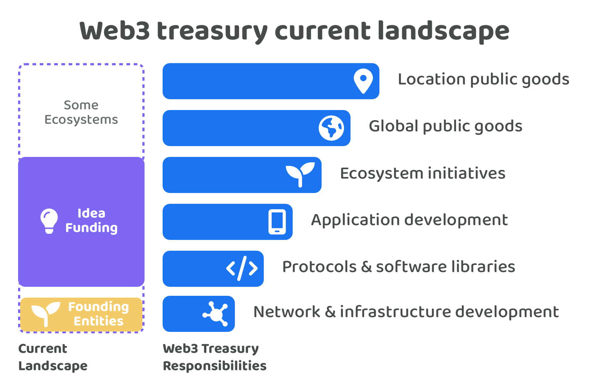

# Current disbursement landscape

Many Web3 ecosystems have their own treasury that they use to fund initiatives that can generate impact for their ecosystem.

<figure><figcaption></figcaption></figure>

The founding entities in each Web3 ecosystem are often mostly responsible for the ongoing maintenance and development of the network itself. Moving above this responsibility the most common process for disbursement is idea based funding. This can often comes in the form of request for proposals (RFPs) that are suggested by the founding entities or in the form of an open proposal process where community members can suggest ideas for approval. For the open proposal process the deciding voters are often a founding entity that look after the treasury or they are the wider community if coin based voting is being used and governance decisions have started to move on-chain.

For the most part idea based funding is usually targeted at building new protocols, software libraries and applications in the ecosystem as well as supporting ecosystem public goods initiatives that can help with maintaining and growing the ecosystem. Some ecosystems invite ideas that help with network & infrastructure development which would compete or compliment the founding entities efforts. Some ecosystems enable proposals that focus on global and location based public goods, these initiatives might not be as focussed on improving and growing the ecosystem itself.

**Problems for contributors**

Idea based disbursement processes can cause a number of problems for contributors.

* **High participation time required** - Contributors need to create ideas to be considered for funding which means a certain amount of upfront work is needed every time a contributor is looking to receive more income. Contributors need to handle the ongoing burden of proposal writing and promotion of their ideas.
* **Proposal submission complexity** - Ideas and contributors are often combined into a single proposal. Sometimes even the priority they are addressing is included in the proposal as well. This submission structure increases the complexity for contributors to participate as now a lot of contribution effort is needed around the priority, idea and contributors involved as they need to be documented upfront so they can make a submission and be considered by the voters.
* **Low contribution flexibility** - A contributors flexibility to work on different impactful ideas is reduced when the incentives are attached to ideas. Contributors have an obligation to execute their ideas that were selected and funded by voters. In these scenarios contributors will either need to go through some form of approval process to change their idea beyond what was voted on or execute the idea as stated. This upfront commitment to an idea they must execute can limit how fast a contributor is able to respond to a fast changing environment and new information and can prevent these contributors from directing their efforts to the most impactful initiatives that emerge.
* **Low income stability** - Contributors that want to receive consistent amounts of funding will need to repeatedly create ideas that get selected by voters. Having one idea funded does not mean the next idea will receive funding. Another factor that impacts income stability is the variance in the time it takes to actually complete an idea against the initial budgeted plan. Most ideas change and evolve over time as the environment changes and new information emerges which makes it much easier for individuals to become under or over paid for their contribution efforts.
* **Budgeting complexity** - A contributor ahead of time needs to define a budget for how much an idea will cost to execute. This can be extremely difficult due to how fast the environment can change in Web3 ecosystems and also because many ideas can be novel and have not been executed before which makes it even more difficult to predict exactly how long they might take to execute. This requirement for budgeting can be a deterrent for contributors to participate due to the upfront amount of work needed to try and estimate these costs and the likelihood that they are underpaid if the idea takes longer than expected to execute.
* **Governance complexity** - There are risks around how incentives are distributed to individual contributors when intermediaries are involved in a project that temporarily hold the assets for a funded idea. If there is a dispute between the management and contributor involved in the execution of an idea there is a risk that the contributor does not get paid for their efforts. Another risk is the potential misuse of theft of funds due to any intermediary that helps with managing the assets of a funded idea.
* **Proposal game theory risks** - One way that proposers can try to increase their chances of receiving compensation is to increase the number of ideas they submit. Sybil resistant systems can help with preventing spam however it is still difficult to restrict users to only a few idea submissions as this can reduce idea flow and collaboration that could lead to impactful outcomes for the ecosystem. Proposers could also exaggerate the costs involved in the execution of an ideas which can be difficult to disprove as each idea is different which makes it difficult to fully know whether a request is fair and reasonable.

**Problems for voters**

Idea based disbursement processes can also cause a number of problems for voters. Voters could be the foundation who decides which ideas get funding or it could be the community using coin based voting.

* **High voter participation time required** - Voters need to review and understand many ideas to make an informed decision on which ideas are the most promising to generate impact for the ecosystem. Each idea could have a large amount of information that needs to be considered such as the skills involved, the outcomes and impact it could generate and the budget and feasibility of the idea. Even for voters that have relevant skills and background experience this task is very difficult to scale to a wide audience due to the time it would take to understand the depth of information provided.
* **High voter decision complexity** - Comparing and selecting ideas required a lot of context about what is happening inside and outside the ecosystem and the trade offs between the different suggested ideas and how they could impact the ecosystem. It is often difficult to predict how successful an idea could be ahead of time. Pushing this complexity towards the voters makes it difficult for them to feasibly participate if they don’t have the right skills, experience or understanding of the ecosystem. This complexity is further increased when the voter needs to understand whether an idea has been fairly budgeted or not as only a handful of voters might have the relevant skills and experience to fully assess what is actually fair and reasonable.
* **Low voter expressiveness** - If a voter agrees with an ideas but believes the contributors are not suitable for execution they might not be able to express this opinion with many of the current disbursement processes. This issue exists when ideas are tightly attached to contributors in the same proposal. If these parts were separated the voter could give their feedback and preferences about an idea without the commitment of selecting someone to execute that idea.
* **Low voter accountability** - Voters are not highly paid for their participation in Web3 disbursement decisions. They are also often free to move to other ecosystems and can sell their existing assets within a relatively small time frame. Voters have low levels of responsibility and accountability of ensuring the ecosystem is successful through good disbursement decisions. Low accountability makes it more difficult to push the entire responsibility of selecting ideas that get funding to a large community of voters due to the lack of incentive and high levels of complexity that each of those voters needs to handle.

**Problems for Web3 ecosystems**

A number of disbursement problems currently exist across many Web3 ecosystems.

* **Ephemeral ideas** - Ideas are often treated as ephemeral yes or no disbursement decisions. This can prevent collaborative efforts and suggested improvements to these previously shared ideas over time. Ecosystems could benefit from having a persistent way to suggest and share ideas that allows them to evolve over time through feedback and community engagement. The importance of ideas can increase and decrease over time as the ecosystem evolves which further increases the need for ideas to be persistent. An ecosystems focus and attention needs to respond to changing environments and the changing needs of the community.
* **Missed innovation opportunities** - Another risk for idea funding is that voters could be more likely to select ideas that are most relevant or interesting to them. Pushing the responsibility of idea selection towards a large group of voters can lead to issues around groupthink and proposers trying to create ideas that appeal to the interests of the voters rather than what might actually be the most impactful idea for the ecosystem. Not all ideas will be obvious to enough voters on why they can generate large amounts of impact. Leaving the selection of ideas to a large community could result in many ideas being rejected or ignored that are less understood or well known but could have been highly impactful if executed.
* **Inefficient treasury asset usage** - A single contributor has a limited amount of capacity to execute different ideas. If a contributor is funded for multiple ideas or for one large idea there is the issue that they might be allocated a large amount of compensation which sits idle whilst they slowly execute their idea or multiple ideas. This can mean a percentage of funding that has been allocated is deadweight to the ecosystem for a period of time. Stagnant treasury assets that are not being fully utilised can reduce the speed of development of impactful ideas. Distributing incentives directly to individuals when they are providing evidence of contribution is one way that this issue can be prevented. Any funding that is released would only be released when contribution efforts are being made. Certain ideas being over funded can also help exacerbate the issue of certain contributors not being able to secure stable income. A lack of income stability increases the risk that these contributors look for better options elsewhere to better support themselves.
* **Lack of prioritisation systems** - Most Web3 ecosystems currently lack prioritisation systems that enable their community to express what different problems and opportunities exist that can then be discussed and voted on to see what the communities current sentiment is about different ecosystem areas. Currently the most adopted ways this is achieved currently is usually through forums, chat channels and on X (formerly Twitter). This lack of prioritisation process means voters are often just responding to what is put in front of them with ideas people suggest rather than having any effective approach to consider what other areas the community might actually prefer to prioritise. A good prioritisation system could help with identifying and selecting the most promising areas the community could work on. More clarity about what the community values can help to inspire more ideas that help to address those problems and opportunities that the wider community most values.

## Learnings from existing tech corporations

**Web3 ecosystem overlapping areas**

Large tech corporations can provide a number of useful learnings about growing a large ecosystem that has many full time contributors. Corporations share a number of overlapping areas with Web3 ecosystems:

* **Number of contributors involved** - Tech corporations such as Apple, Microsoft, Amazon, Alphabet and Meta have scaled to handle a vast number of contributors that work on different products and services within each of their ecosystems.
* **Problem scale** - Large tech corporations often tackle important global problems. Their products and services can often become important parts of peoples day to day lives.
* **Complexity** - Larger tech companies are able to work on highly complex topic areas such as AI, augmented reality and virtual reality. These new technologies can require large investments and longer time horizons to make highly impactful products and services.
* **Shared internal solutions** - A number of shared problems between teams often emerge within these organisations that lead to the development of internal tooling and solutions that can benefit the entire organisation. These solutions could be adopted by any team working on different products or services. A good example of this is React or GraphQL which was developed internally and used across Meta before then being released publicly as open source software.

**Corporation working environment**

Other useful learnings that can be taken from existing tech corporations are the environments they have created that can help their contributors focus and thrive whilst they work on important problems. Some of these environmental approaches include:

* **Time based incentives** - Contributors are paid for their time using an agreed salary. Contributors do not need to be concerned with where and how they are getting paid and instead can focus their entire attention on their work whilst contributing in a corporation.
* **Bonus incentives** - Large corporations often offer performance and impact based incentives in the form of stock option grants, bonuses and job promotions. Work place incentives can also exist which can further help with simplifying and improving the lives of employees.
* **Idea contribution flexibility** - Employees are able to move across teams and help make impactful contributions where they are most needed. Some corporations are more flexible than others in terms of letting people change teams. Employees do not need to be concerned with how they are going to be paid when they work across multiple teams and help with different initiatives.
* **Collaborative environment** - Teams working on different projects and services can freely collaborate with any other team in the corporation. These employees all work in the same corporation so ultimately they are on the same team! The incentives are fully aligned for employees to collaborate on any problems or opportunities that could be mutually beneficial to address.
* **Quickly changing ideas** - Teams working on different products & services can sometimes autonomously plan their own roadmap and delivery of new features and improvements. This enables them to experiment and trial new ideas quickly as different opportunities emerge without needing approval from the wider company and surrounding teams.
* **Starting & stopping the execution of ideas** - Teams are able to start and stop working on different ideas whenever it makes sense to do so. Some ideas won’t generate the intended outcomes and in that event a team could stop working on it as soon as this becomes more obvious. If a team moves from one idea to another this won’t change or impact their incentives. Each employee and team are ultimately responsible for making as much impact for the corporation as possible.

**Common reasons people leave corporations**

Listing some common reasons why people leave corporate environments can help with identifying which disbursement approaches might help with resolving or reducing these issues.

* **Better work-life balance** - Looking for opportunities that have better work-life balance.
* **Looking for more meaningful work** - Current responsibilities or working environment is uninspiring.
* **Personal values misalignment** - Actions and outcomes generated by the company don’t align with personal values.
* **Lack of career advancement** - A lack of opportunities to grow and learn.
* **Burnout** - A need for recovery due to over working.
* **Management & leadership issues** - Conflict or disagreement with people that have authority.
* **Compensation & benefits** - Compensation and benefits have not met expectations.
* **Entrepreneurial aspirations** - Trying to start a new business themselves.
* **Relocation -** Wanting to live and work in another location.
* **Changing work interests** - Looking to try something new or more challenging.

**Corporation comparison with current Web3 disbursement landscape**

* **Less complexity to contribute** - In a corporation an employees just needs to submit their personal and professional information, usually in the form of a CV, to be considered. In Web3 ecosystems contributors need to define and suggest ideas ahead of time which takes a large amount of upfront work.
* **Higher income stability** - In corporations once an employees is hired they will be compensated until they leave. In Web3 ecosystems a contributor has to continuously write and submit idea based proposals to receive future funding. Funding can be distributed far more unevenly in Web3 ecosystems using idea based funding which means many contributors could also have high income instability where they receive little to no compensation for periods of time.
* **Higher contribution flexibility** - Employees that join a corporation are often able to work on different ideas and teams whilst they work in the organisation. The team an employee is working on could completely change the idea they are working on if they had good reason to do so to address a completely different problem or opportunity. In Web3 ecosystems if every idea is funded separately there is a higher complexity to move to different ideas unless there is enough funding available and a separate agreement is made. As well as this there is more complexity when a token has been created as now the contributors are responsible for maintaining and growing the ecosystem that this token is used for. This can prevent contributors from being able to move as easily between ideas even when they might be able to generate a lot of impact in numerous areas.
* **Easier collaboration** - In corporations employees are paid for their contribution efforts each month rather than for the ideas that they suggest or that get executed. This means it doesn’t matter which idea an employee is working as long as the outcomes generate impact for the corporation. Collectively these employees are all working on the same team which enables teams to more easily identify intersecting problems and opportunities that they could work on collaboratively. Software libraries created in Meta such as React and GraphQL are good examples of this. In Web3 ecosystems collaboration is more complex when funding is allocated through ideas as now if one team executes these intersecting ideas and doesn’t complete their own funded idea they risk not being funded in the future. Contributors have to compete against each other constantly to receive funding which doesn’t fully align the incentives to collaborate on allocating extra time to build out mutually beneficial solutions.
* **Less complexity for decision makers** - Corporations focus on identifying, attracting and retaining the highest quality people to work in their organisation. The complexity for corporations is comparing and selecting the best contributors. In Web3 ecosystems this complexity is often far higher as ideas are being compared instead of contributors which means a lot more information and complexity is introduced. Many of the voters will struggle to have the right level of experience and context about many of these ideas to make well informed decisions. Web3 ecosystems that want to fully decentralise this idea selection approach will be pushing this massive complexity to the wider community.
