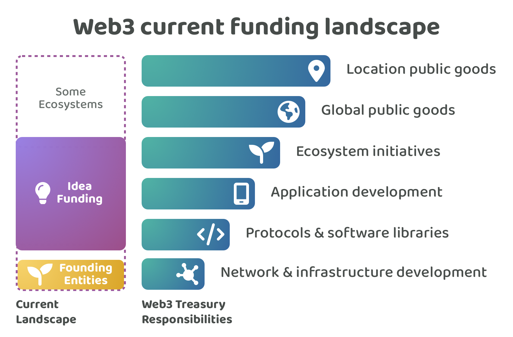
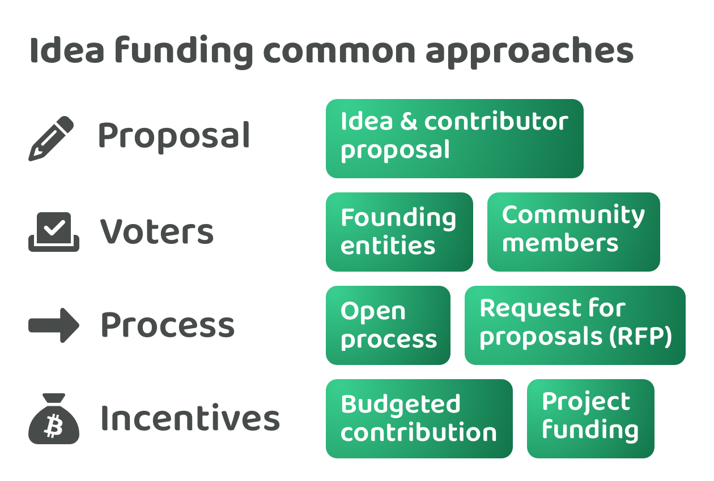

# Current funding landscape

<figure><figcaption></figcaption></figure>

Many Web3 ecosystems have their own treasury which is used to help fund initiatives that generate impact for the ecosystem. Founding entities in each Web3 ecosystem are often responsible for the ongoing maintenance and development of the network itself. Moving above this responsibility the most common process for funding is idea based funding. This can often come in the form of requests for proposals (RFPs) that are suggested by the founding entities or an open proposal process is used where community members can suggest ideas for voter approval. For the open proposal process the deciding voters are often a founding entity that look after the treasury or they are the wider community if coin based voting is being used and governance decisions have started to move on-chain.

Idea funding often helps with funding initiatives that focus on building new protocols, software libraries and applications in the ecosystem or for supporting ecosystem initiatives that help with maintaining and growing the ecosystem. Some ecosystems invite ideas that help with network & infrastructure development which could compete or compliment the founding entities own efforts. Some ecosystems invite proposals that focus on global and location based public goods, however these initiatives might not be as relevant or focussed on improving and growing the ecosystem itself.

<figure><figcaption></figcaption></figure>

We can go into a bit more detail about idea funding. Idea proposals usually cover the details about the idea whether broadly as a project or more specifically as an idea with a number of execution steps. This is then usually coupled with information about the contributors who are going to be involved with executing that idea.

For voters, the responsibility of selecting ideas is either handled by the founding entities or by the community members. Community member voting usually means that an on-chain voting solution has already been developed and is available for the the ecosystem to use.

Many idea funding processes are often open where anyone can submit proposals that will then be considered. These proposals may all go into the same bucket or category or there might be separate categories that handle different types of idea or different amounts of funding. The other process you also see are request for proposals. These are often created and handled by a founding entity. Founding entities will identify some priority that could be addressed by the community and convert that priority into a request for proposals so that community members idea proposals can be selected and compensated to help with addressing that problem or opportunity.

Finally in terms of incentives you often have budgeted contributions where the proposers will outline what they intend to execute and how long they believe it will take, this then results in a total requested budget. Some ecosystems may enable project funding where the project outlines what it’s overall purpose is but doesn’t commit to any specific execution outcomes. In these situations the community would be just be supporting these projects more broadly with what they’re working on.

**Problems for contributors**

Idea based funding processes can cause a number of problems for contributors.

* **High participation time required** - Contributors need to create ideas to be considered for funding which means a certain amount of upfront work is needed every time a contributor is looking to receive more income. Contributors need to handle the ongoing burden of proposal writing and promotion of their ideas.
* **Proposal submission complexity** - Ideas and contributors are often combined into a single proposal. Sometimes the priorities they are addressing are also included in the proposal which might also include any justifications about why those priorities are currently important. This submission structure increases the complexity for contributors to participate as now a lot of contribution effort is needed around presenting information about priorities, an idea and the contributors involved all in a single proposal that is documented upfront so they can make a submission and be considered by the voters. Proposers also need to handle this complexity each and every time they want to be funded for a different idea. The complexity is only further increased by the fact that these ecosystem can change very quickly meaning it can be very difficult to accurately budget how long a given idea will take to execute due to the community, tools and infrastructure that is constantly changing around them.
* **Low contribution flexibility** - A contributors flexibility to work on different impactful ideas is reduced when the incentives are attached to ideas. Contributors have an obligation to execute their ideas that were selected and funded by voters. Contributors either need to go through some form of approval process to change their idea beyond what was voted on or accept they need to execute the idea as stated. This can be an issue due to the fact that more impactful ideas could emerge as time goes on and intersecting ideas that benefit multiple teams could also emerge. In these situations these ideas would need to receive funding separately first or an arrangement needs to be made to agree on where the funding is coming from to pay for the contribution efforts that are needed to execute these new ideas. These efforts to resolve compensation could occur each and every time a new idea is executed or contributors could alternatively ignore this issue and accept that they just won’t get paid for those efforts. This upfront commitment to an idea they must execute can limit how fast a contributor is able to respond to a fast changing environment and new information and can prevent these contributors from directing their efforts to the most impactful initiatives that emerge. Contributors become less flexible in how they can work in the ecosystem due to the ongoing burden of working out how they are going to get paid for all the different things that they could help with when trying to generate impact for the ecosystem.
* **Low income stability** - Contributors that want to have a more reliable income stream would need to repeatedly create ideas that then get selected by voters. Having one idea funded does not mean the next idea will receive funding, it will often be difficult to predict which ideas a community of voters is going to select with any high degree of accuracy. Another factor that impacts income stability is the variance in the time it takes to actually complete an idea against the initial budgeted plan. Most ideas change and evolve over time as the environment changes or as new information emerges. This makes it much more likely that individuals become under or over paid for their contribution efforts due to this unpredictability.
* **Budgeting complexity** - Budgets can greatly increase the complexity of idea planning. Idea planning is an important task in any scenario as it helps with better understanding how to execute an idea by breaking it down into different steps and tasks that are involved. Adding a budget commitment to this is where the complexity and risks are introduced. Accurately estimating how long an idea will take to execute can be extremely difficult at the best of times, and even more so with fast changing Web3 ecosystems. Ideas that are novel and that have not been executed before add further complexity when predicting exactly how long it will take to execute that idea. This requirement for budgeting can be a deterrent for contributors to participate due to the upfront amount of work needed to try and estimate and commit to these costs and then also the ongoing risk around the likelihood that they are going to be underpaid due to the idea taking far longer to execute than expected due to these changing variables and factors, many of which they have no control over.
* **Governance complexity** - There are risks around how incentives are distributed when some stakeholders involved in that project temporarily have custody over these assets for a funded idea. If there is a dispute between the management and contributors involved in the execution of an idea there is a risk that some of the contributors do not get paid for their efforts. Even with a distributed multi-signature approach this dispute could still happen. Another risk is the potential misuse or theft of funds due to certain stakeholders becoming malicious whilst having control of the assets for a funded idea. The larger the amount of funding an idea receives the more incentive there is for an individual or small group of individuals to abuse their position of control.
* **Proposal game theory risks** - Proposers could try to increase their chances of receiving compensation by increasing the number of ideas they submit. Sybil resistant systems can help with preventing spam however it is still difficult to restrict users to only submit a few ideas as this could reduce idea flow and potential collaboration around different ideas. Another game theory risk is around proposers that attempt to exaggerate the costs that are involved in the execution of an idea. This could be extremely time consuming and complex to disprove as each idea is different in what they are working on meaning each one would need to be moderated and verified on whether their budget is actually fair and reasonable.

**Problems for voters**

Idea based funding processes can also cause a number of problems for voters. Voters could be the foundation who decides which ideas get funding or it could be the community using coin based voting.

* **High voter participation time required** - Voters need to review and understand many ideas to make an informed decision when selecting the ideas that they believe will be the most promising for generating impact for the ecosystem. Each idea could have a large amount of information that needs to be considered such as the skills involved, the outcomes and impact it could generate and the budget and feasibility of that idea. Even for founding entities that take on this responsibility that have the relevant skills and background experience this task is extremely time consuming making it extremely difficult to scale this to a large number of people unless they are properly compensated for that time.
* **High voter decision complexity** - Comparing and selecting ideas requires a lot of context about what is happening inside and outside the ecosystem and the trade offs between the different suggested ideas and how they could impact the ecosystem. It will often be difficult to predict whether an idea is actually going to generate any impact or not ahead of time. Pushing this complexity towards the community makes it difficult for them to feasibly participate if they don’t have the right skills, experience or understanding of the ecosystem. Beyond just comparing the quality of ideas overall the voter also needs to understand whether an idea has been fairly budgeted or not or whether the contributors are even suitable for executing that idea, only a handful of voters may have the relevant skills and experience to fully assess whether an idea is fair and reasonable in terms of the budget and its feasibility based on the scope of the idea and the contributors who are involved.
* **Low voter expressiveness** - Voter expressiveness is also something that can be often problematic with existing idea funding systems. If a voter agrees with an idea but believes the contributors are not suitable for the execution of that idea they might not be able to easily express that opinion within any of their voting decisions. And vice versa a voter might disagree with an idea but would like to see those contributors working in the ecosystem due to their experience and skill sets. This issue exists when ideas and contributors are attached in the same proposal within a single funding decision. If these parts were separated the voter could more easily give their feedback and preferences about an idea without the commitment of selecting who is going to execute that idea in the same decision.
* **Low voter accountability** - Voters are usually either not paid or not paid large amounts for their participation in these funding decisions. They are usually free to move to other ecosystems and can sell their existing assets within a relatively small time frame. This means voters have low levels of responsibility and accountability to ensure the ecosystem makes good funding decisions. This makes it far more difficult to push large complexity and responsibilities towards these community members who likely don’t have the capacity or willingness to tackle highly complex governance decisions when there is not sufficient compensation for their time. Idea selection often means pushing far too much complexity onto the voters who are often not sufficiently informed, incentivised or accountable for handling such complexity. It is of vital importance that community governance is simple so that these systems are actually scalable. An ecosystem needs to understand the exact implications and complexity of the governance decisions that they are pushing towards community members and need to be able to justify that complexity over other approaches. An ecosystem will want to be very specific about what governance decisions it expects the wider community to handle and which areas can and should be delegated.

**Problems for Web3 ecosystems**

A number of funding problems currently exist across many Web3 ecosystems.

* **Ephemeral ideas** - Ideas are often treated as ephemeral yes or no funding decisions. This can be problematic for encouraging collaborative efforts and suggesting improvements to these ideas over time. Ecosystems could alternatively have a persistent way to suggest and share ideas that increases the exposure of these ideas to the community. This can help with increasing the amount of engagement and feedback an idea receives. The importance of ideas can increase and decrease over time as the ecosystem changes which further increases the need for ideas to be more persistent so that execution can be paused whenever it makes sense to do so. A community member could have a fantastic amount of experience and skills that are relevant to a number of impactful ideas that they want to suggest or give feedback to. Those same community members also may have no interest in personally executing those ideas for any number of reasons. An ecosystem can benefit from enabling those community members to contribute to the ecosystem and provide value in the way they would like to - which could be just suggesting and sharing their thoughts about potentially impactful ideas.
* **Missed innovation opportunities** - Another potential problem with idea funding is that when the community is responsible for selecting every idea that is going to receive funding it becomes much more likely that innovative but less well understood or well known ideas get rejected and ignored. Issues could emerge around groupthink or due to voters simply focussing their attention towards the areas that are most relevant to them rather than the ideas that could be the most impactful for the ecosystem. It might be less clear or obvious for a number of ideas on how they are going to generate large amounts of impact without the voter having enough experience and context to understand the potential of that idea.
* **Inefficient treasury asset usage** - A problem for Web3 ecosystems is around the active and efficient use of treasury assets that get disbursed. A single contributor has a limited amount of capacity to execute ideas. If a contributor is funded for multiple ideas or for one large idea there is the potential issue that they might be allocated an excessive amount of funding which then sits idle whilst they execute those ideas. This could mean that a percentage of funding is now deadweight for the ecosystem for a certain period of time due to that funding being idle and not being actively used to pay for contribution efforts. Stagnant treasury assets that are not being fully utilised can mean reducing the speed of development of impactful ideas. Excessive funding for one individual or group of contributors can also mean less funding for other contributors which can further lead even more reduced income stability across the ecosystem.
* **Lack of prioritisation systems** - Another problem is the lack of prioritisation systems across Web3 ecosystems. Many Web3 ecosystems currently rely on the founding entities to help with prioritisation or are discussing these priorities in existing systems such as forums, chat channels or on X (formerly Twitter). Community members are often unable to vote on the different priorities that might exist which could help with finding out what the communities current sentiment is about these different problems and opportunities. Another key issue to consider here is that the priorities that the community vote on might not align with any of the ideas that have recently been suggested. If ecosystems can increase the clarity and exposure about what the community actually prioritises and values this could drastically help with inspiring more targeted ideas that can help with addressing those specific problems and opportunities that the wider community currently most values.
