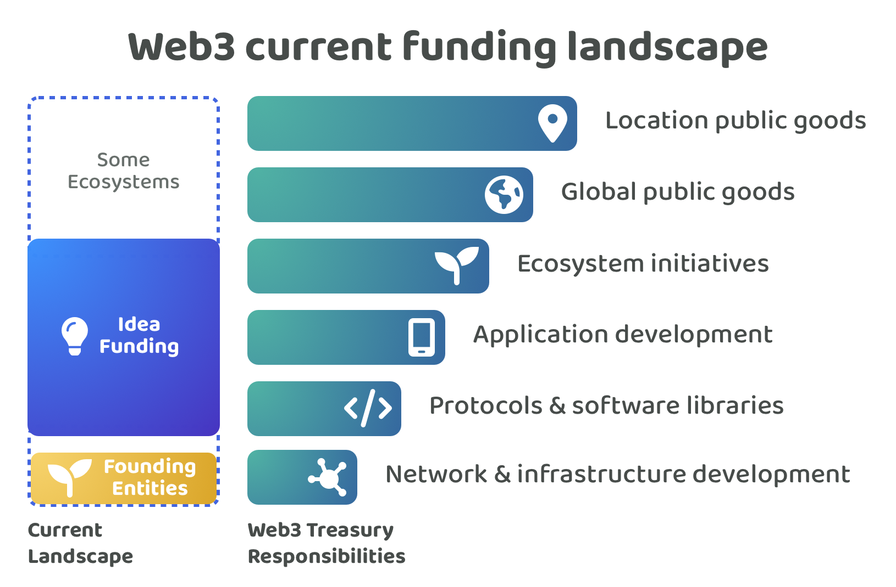

# Current funding landscape

<figure><figcaption></figcaption></figure>

Many Web3 ecosystems have their own treasury which is used to help fund initiatives that generate impact for the ecosystem. Founding entities in each Web3 ecosystem are often responsible for the ongoing maintenance and development of the network itself. Moving above this responsibility the most common process for funding is idea based funding. This can often come in the form of requests for proposals (RFPs) that are suggested by the founding entities or an open proposal process is used where community members can suggest ideas for voter approval. For the open proposal process the deciding voters are often a founding entity that look after the treasury or they are the wider community if coin based voting is being used and governance decisions have started to move on-chain.

Idea funding often helps with funding initiatives that focus on building new protocols, software libraries and applications in the ecosystem or for supporting ecosystem initiatives that help with maintaining and growing the ecosystem. Some ecosystems invite ideas that help with network & infrastructure development which could compete or compliment the founding entities own efforts. Some ecosystems invite proposals that focus on global and location based public goods, however these initiatives might not be relevant or focussed on improving and growing the ecosystem itself.

<figure><figcaption></figcaption></figure>

The most common proposal format for idea funding is where proposers document the execution goals of their project or idea and also list the contributors that will be involved in execution. Voters are usually either the founding entities or the community members. Community member voting is often achieved using on-chain voting mechanisms. The processes most commonly used are either an open process where any community member can submit an idea to be considered by the voters and request for proposal processes where the types of ideas that will be considered are stated before proposal submission begins. In terms of incentives the funding processes usually either use budgeted contribution efforts where costs are stated fully ahead of time to pay for the execution of some or all parts of an idea or these initiatives may receive funding without a stated budget and instead funding is provided to help support the projects ongoing contribution efforts.

**Problems for contributors**

Idea based funding processes can cause a number of problems for contributors.

* **High participation time required** - Contributors need to create ideas to be considered for funding which means a certain amount of upfront work is needed every time a contributor is looking to receive more income. Contributors need to handle the ongoing burden of proposal writing and promotion of their ideas.
* **Proposal submission complexity** - Ideas and contributors are often combined into a single proposal. Sometimes even the priority they are addressing is included in the proposal as well. This submission structure increases the complexity for contributors to participate as now a lot of contribution effort is needed around the priority, idea and contributors involved as they need to be documented upfront so they can make a submission and be considered by the voters.
* **Low contribution flexibility** - A contributors flexibility to work on different impactful ideas is reduced when the incentives are attached to ideas. Contributors have an obligation to execute their ideas that were selected and funded by voters. In these scenarios contributors will either need to go through some form of approval process to change their idea beyond what was voted on or execute the idea as stated. This upfront commitment to an idea they must execute can limit how fast a contributor is able to respond to a fast changing environment and new information and can prevent these contributors from directing their efforts to the most impactful initiatives that emerge.
* **Low income stability** - Contributors that want to receive consistent amounts of funding will need to repeatedly create ideas that get selected by voters. Having one idea funded does not mean the next idea will receive funding. Another factor that impacts income stability is the variance in the time it takes to actually complete an idea against the initial budgeted plan. Most ideas change and evolve over time as the environment changes and new information emerges which makes it much easier for individuals to become under or over paid for their contribution efforts.
* **Budgeting complexity** - A contributor ahead of time needs to define a budget for how much an idea will cost to execute. This can be extremely difficult due to how fast the environment can change in Web3 ecosystems and also because many ideas can be novel and have not been executed before which makes it even more difficult to predict exactly how long they might take to execute. This requirement for budgeting can be a deterrent for contributors to participate due to the upfront amount of work needed to try and estimate these costs and the likelihood that they are underpaid if the idea takes longer than expected to execute.
* **Governance complexity** - There are risks around how incentives are distributed to individual contributors when intermediaries are involved in a project that temporarily hold the assets for a funded idea. If there is a dispute between the management and contributor involved in the execution of an idea there is a risk that the contributor does not get paid for their efforts. Another risk is the potential misuse of theft of funds due to any intermediary that helps with managing the assets of a funded idea.
* **Proposal game theory risks** - One way that proposers can try to increase their chances of receiving compensation is to increase the number of ideas they submit. Sybil resistant systems can help with preventing spam however it is still difficult to restrict users to only a few idea submissions as this can reduce idea flow and collaboration that could lead to impactful outcomes for the ecosystem. Proposers could also exaggerate the costs involved in the execution of an ideas which can be difficult to disprove as each idea is different which makes it difficult to fully know whether a request is fair and reasonable.

**Problems for voters**

Idea based funding processes can also cause a number of problems for voters. Voters could be the foundation who decides which ideas get funding or it could be the community using coin based voting.

* **High voter participation time required** - Voters need to review and understand many ideas to make an informed decision on which ideas are the most promising to generate impact for the ecosystem. Each idea could have a large amount of information that needs to be considered such as the skills involved, the outcomes and impact it could generate and the budget and feasibility of the idea. Even for voters that have relevant skills and background experience this task is very difficult to scale to a wide audience due to the time it would take to understand the depth of information provided.
* **High voter decision complexity** - Comparing and selecting ideas required a lot of context about what is happening inside and outside the ecosystem and the trade offs between the different suggested ideas and how they could impact the ecosystem. It is often difficult to predict how successful an idea could be ahead of time. Pushing this complexity towards the voters makes it difficult for them to feasibly participate if they don’t have the right skills, experience or understanding of the ecosystem. This complexity is further increased when the voter needs to understand whether an idea has been fairly budgeted or not as only a handful of voters might have the relevant skills and experience to fully assess what is actually fair and reasonable.
* **Low voter expressiveness** - If a voter agrees with an ideas but believes the contributors are not suitable for execution they might not be able to express this opinion with many of the current funding processes. This issue exists when ideas are tightly attached to contributors in the same proposal. If these parts were separated the voter could give their feedback and preferences about an idea without the commitment of selecting someone to execute that idea.
* **Low voter accountability** - Voters are not highly paid for their participation in Web3 funding decisions. They are also often free to move to other ecosystems and can sell their existing assets within a relatively small time frame. Voters have low levels of responsibility and accountability of ensuring the ecosystem is successful through good funding decisions. Low accountability makes it more difficult to push the entire responsibility of selecting ideas that get funding to a large community of voters due to the lack of incentive and high levels of complexity that each of those voters needs to handle.

**Problems for Web3 ecosystems**

A number of funding problems currently exist across many Web3 ecosystems.

* **Ephemeral ideas** - Ideas are often treated as ephemeral yes or no funding decisions. This can prevent collaborative efforts and suggested improvements to these previously shared ideas over time. Ecosystems could benefit from having a persistent way to suggest and share ideas that allows them to evolve over time through feedback and community engagement. The importance of ideas can increase and decrease over time as the ecosystem evolves which further increases the need for ideas to be persistent. An ecosystems focus and attention needs to respond to changing environments and the changing needs of the community.
* **Missed innovation opportunities** - Another risk for idea funding is that voters could be more likely to select ideas that are most relevant or interesting to them. Pushing the responsibility of idea selection towards a large group of voters can lead to issues around groupthink and proposers trying to create ideas that appeal to the interests of the voters rather than what might actually be the most impactful idea for the ecosystem. Not all ideas will be obvious to enough voters on why they can generate large amounts of impact. Leaving the selection of ideas to a large community could result in many ideas being rejected or ignored that are less understood or well known but could have been highly impactful if executed.
* **Inefficient treasury asset usage** - A single contributor has a limited amount of capacity to execute different ideas. If a contributor is funded for multiple ideas or for one large idea there is the issue that they might be allocated a large amount of compensation which sits idle whilst they slowly execute their idea or multiple ideas. This can mean a percentage of funding that has been allocated is deadweight to the ecosystem for a period of time. Stagnant treasury assets that are not being fully utilised can reduce the speed of development of impactful ideas. Distributing incentives directly to individuals when they are providing evidence of contribution is one way that this issue can be prevented. Any funding that is released would only be released when contribution efforts are being made. Certain ideas being over funded can also help exacerbate the issue of certain contributors not being able to secure stable income. A lack of income stability increases the risk that these contributors look for better options elsewhere to better support themselves.
* **Lack of prioritisation systems** - Most Web3 ecosystems currently lack prioritisation systems that enable their community to express what different problems and opportunities exist that can then be discussed and voted on to see what the communities current sentiment is about different ecosystem areas. Currently the most adopted ways this is achieved currently is usually through forums, chat channels and on X (formerly Twitter). This lack of prioritisation process means voters are often just responding to what is put in front of them with ideas people suggest rather than having any effective approach to consider what other areas the community might actually prefer to prioritise. A good prioritisation system could help with identifying and selecting the most promising areas the community could work on. More clarity about what the community values can help to inspire more ideas that help to address those problems and opportunities that the wider community most values.
