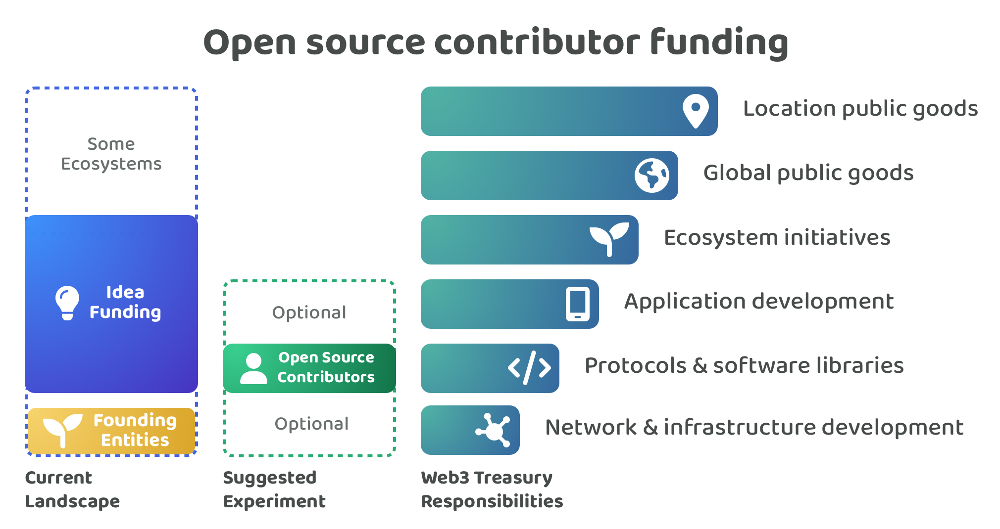

# Open source contributor funding

<figure><figcaption></figcaption></figure>

There is an opportunity for Web3 ecosystems to experiment with a open source contributors funding process. Ecosystem contributors would be selected and compensated to work on open source initiatives. The key parts for this suggested process include:

* **Contributor information** - Open source developers would be able to submit their personal and professional information along with any of their contribution history information so they can then be considered as a contributor candidate.
* **Voting** - The voters would either be a founding entity or the wider community depending on the ecosystems preferences and what voting systems are available.
* **Compensation** - Contributors can request the salary they would be happy with for the period of time they would be contributing. Voters would decide which contributor proposals to accept. Salary ranges could be added as guidelines. Contributors could be paid monthly.
* **Contributor working arrangement** - Contributors would be paid for their time spent working in the ecosystem to execute different open source initiatives. Contributors could be paid monthly for a set term length, such as 3, 6 or 12 months.
* **Contributor responsibilities** - Open source contributors would be responsible for supporting any open source initiatives that could create high impact for the ecosystem. That could range from bug fixes, improvements to existing software or entirely new tools and libraries. Founding entities usually handle the network & infrastructure development in many Web3 ecosystems. An opportunity for open source contributors is to become a supporting structure that sits above the founding entities and is responsible for the development of protocols and software libraries. Ecosystems could optionally encourage open source contributors to also help network & infrastructure development efforts or application development as well.
* **Contribution verification** - Contributors would submit monthly contribution logs that show evidence of the work they’ve completed that month. This would be required to be eligible to receive the next months funding.

**Supporting rationale & analysis**

The advantages of this suggested process are covered below. However to read more about the analysis and background behind this proposal it is worth reviewing the disbursement analysis:


[Disbursement](https://app.gitbook.com/o/jOQu4b6VLDxaQsg2rVwG/s/8L61e8ulVlk90t5mlQk1/)


## Advantages for c**ontributors**

**Quick & simple participation**

Contributors just need to submit their personal and professional information along with any contribution history to showcase their skill sets and the impact they have already generated to be considered as a paid contributor. Contributors don’t have to suggest new ideas and instead can just help with existing or new open source initiatives.

**Removed budgeting complexity**

Contributors could work on one or many open source initiatives. The contributor doesn’t need to do budget planning ahead of time for the ideas they work on which saves them time each time they work on a different idea. This removal of budget planning also helps to remove the risks of under or over compensation due to an idea taking longer or shorter than expected. Paying contributors based on the time they work means ideas can more easily change and evolve as required due to a changing environment or requirements.

**Income stability**

Contributors being paid for their time means they will receive increased stability in their income. They also get full awareness of how long they will be compensated for as their duration of payment will be known when they are selected as a contributor. This means contributors can spend their time fully focussed on executing impactful ideas rather than being concerned about ongoing budgeting concerns during their period of contribution.

**Flexible contribution**

Contributors can work on one or multiple ideas whilst they are being compensated by the ecosystem to work on open source initiatives. This enables a contributor to align their efforts with the initiatives that can generate the most impact for the ecosystem. This autonomy also gives the contributor more responsibility and accountability to identify the most impactful initiatives over time as they are not tied to one idea.

**Reduced governance risks**

Funding comes from the treasury and goes directly to the selected contributors. This helps to remove governance risks around having any intermediaries that could have held these assets temporarily. A small number of actors could have misused or stole those funds that were supposed to pay for contribution efforts. Instead by paying contributors directly the incentive risks are localised to each individual contributor and the risk for each contributor is a single months worth of compensation.

**Increased depth of experience**

Enabling contributors to work on the most impactful open source initiatives across an ecosystem can help with creating an environment where these contributors become very well informed about the different approaches that can be used to build applications and protocols. This exposure to many open source initiatives can also help with improving their awareness and understanding of what the biggest problems and opportunities are that could be resolved through improving existing solutions or by creating new tools or libraries.

**Reputation building**

Funding that is focused on selecting skilled individuals to help with open source initiatives can help with creating an environment that could use self sovereign identity solutions. Contributors could be able to build up their reputation with different credentials and peer to peer attestations. These credentials could help to highlight the contributions and impact that each contributor has helped to generate for the ecosystem. Contributors could start building up their reputation at anytime which can help them with getting selected in future disbursement decisions.

**Inherits the best parts of working for existing large tech companies**

Most or all of the best parts of working in large tech company environment for employees can be achieved with an open source contributor disbursement process. The simplicity of time based incentives and the importance of contribution flexibility and a collaborative environment would be a key part of this suggested process. The added advantages of an open source disbursement process over existing working arrangements in tech companies is that can push beyond the advantages of working in large tech companies and gives the contributors even more autonomy on how they decide to generate impact for the ecosystem. The contributor would ultimately be their own boss and have full ownership and responsibility over building their own reputation. Contributors would be able to work wherever and whenever they want as long as they generate impact for the ecosystem. Contributor focused funding could give people high levels of flexibility, reputation ownership and autonomy.

**Helps reduce or resolve the common issues of why people leave large tech companies**

* **Better work-life balance & burnout** - Incentives can help to encourage and reward contributors that work harder than others in the ecosystem but the actual choice of how much time a contributor is willing to use from their daily lives is fully up to them.
* **Relocation** - A contributor working for an online Web3 ecosystem can work anywhere in the world they want, relocation should never be an issue!
* **Lack of career advancement & changing work interests** - A contributor self determines what they work on based on their own interests and based on what has the most meaning to them.
* **Meaningful work, personal values misalignment & entrepreneurial aspirations** - The outcomes that a contributor generates will be open source and publicly available. Their work could be used by an entire ecosystem and could even make impact more globally.
* **Management & leadership issues** - No fixed management or leadership roles will exist in Web3 ecosystems under this approach, meaning no one will be pushing contributors to work over time and beyond their means. If a contributor didn’t enjoy working with another contributor they would be able to move to other initiatives when it makes sense for them to do so.

## Advantages for voters

**Faster and simpler decision making**

Voters wouldn’t need to compare and vote on a number of open source ideas that they might not fully understand and instead can focus on reviewing the competencies and experience of a number of contributors that could help with the execution of any open source initiative. This approach helps to reduce the complexity and time required for voters to participate in the disbursement governance process. Decreasing the time required and complexity for voters to participate can drastically help with increasing the scalability of these governance processes.

**Easier future decisions**

Priorities and ideas will naturally change and evolve over time meaning the complexity of selecting these each time remains at a certain level. However quality contributors should be far more consistent over a long period of time which means that contributor selection can become easier over time as voters become aware of the most competent and effective contributors who they can repeatedly select to receive funding. More tools and processes that help to highlight a contributors impact generated can further improve this ease of future decision making. Future decisions becoming easier over time means that scalability of the governance process for voters can be greatly increased over time making it easier for a larger population of people to participate.

**Idea feedback is still captured**

Selecting contributors instead of ideas doesn’t mean the voters wouldn’t have their voices heard during idea generation and selection. Any process for generating and selecting ideas can be fully public and invite the entire community to offer their preferences and opinions. The key difference is that open source contributors would be the ones who have accountability to select the most promising ideas and respond to any community engagement and feedback. Contributors are paid for their contribution time so are incentivised to work on the most impactful ideas for the ecosystem otherwise they might not get selected again in the future.

## Advantages for Web3 ecosystems

**Efficient usage of incentives**

Assets being disbursed would be actively used to generate impact for the ecosystem as they would only be distributed to contributors to pay for their recent contribution efforts. Contributors would also only be eligible for future payment upon the submission of a monthly contribution log that records their recent contributions. This reduces the amount of assets that are sitting around and not being used immediately to generate contribution efforts that could generate impact for the ecosystem.

**Environment helps create skilled contributors**

Enabling contributors to work on the most impactful open source initiatives across the ecosystem will enable contributors to self identify and allocate their time to initiatives that can generate the most impact. This in itself is a skill set in being able to identify what is highest priority for the ecosystem. Contributors who are effective at proving they can identify and address important problems and opportunities can be compensated well for doing so. The amount of different areas that a contributor can help with can also help with creating an environment where contributors become very well informed on what the biggest problems and opportunities are in the ecosystem and how an application team could build out more technical and complex solutions using the current infrastructure and software available.

**Improved developer experience**

Open source initiatives can help speed up existing and future teams in developing their own solutions. Any developer experience improvements can have a large impact on the wider ecosystem. The faster and cheaper it becomes to build applications the more it can encourage people to build solutions or for more investment to come in to experiment with new use cases and opportunities. Open source contributors could even help support these teams in understanding and applying the different libraries and tools that exist in the ecosystem to help them improve their own solutions. Open source software can create a flywheel of making it easier to develop applications and protocols that are increasingly complex over time. Improving the developer experience across the ecosystem can help with creating a compounding amount of impact over time.

**Increased collaboration**

Open source contributors can develop new open source software and also help existing teams with building their own open source solutions. If a number of contributors are available to help a project if their project is open source there is an increased opportunity for collaboration to emerge across projects. Open source contributors will be able to spot problems that are shared across many projects and identify solutions that could be used by many different projects. These intersecting software solutions could be useful for many projects to speed up their own development. Open source contributors can be seen as a collaborative glue that helps to bring together the ecosystem to more easily identify the most impactful problems that could be address. Increasing the amount of collaboration can also help with reducing the amount of duplicated efforts and outcomes that could have been occurred if open source contributors weren’t available to help with developing open source solutions.

**Incentivises open source solutions**

Open source contributors would have a policy that they are only allowed to work on open source software. This simple requirement helps to create a positive reinforcing incentive for projects in the ecosystem to open source their code. A project with only a few developers could have immediate access to the support of multiple open source contributors to help with their projects development if they chose to open source. Projects that chose not to open source their code and compete with ones that do might now do so at a serious disadvantage. This simple incentive could lead to a growing percentage of projects that open source their code immediately when starting execution. The entire ecosystem would then benefit from this code as a learning resource for their own projects.

**Reduces game theory risks**

Individuals who request funding to become a contributor will do so by stating the expected salary they are looking for. There is a much larger amount of data available online that helps to show what the lower and upper ranges are for different roles and skill sets. This makes it more difficult for a contributor candidate to exaggerate the amount of funding they should expect based on the evidence they provide. This approach can help to prevent the issues that can exist with idea based proposals which can make it easier for proposers to exaggerate the amount of work that needs doing or the different people they need to pay to get the work done.

## Future opportunities & narratives

**Faster adoption of self sovereign identity solutions**

A disbursement process that is focussed on selecting contributors can help to increase the speed of adoption of self sovereign identity solutions. Credentials that help with recording contribution history, impact and performance, education & skills and any peer to peer attestations could all help to create an ongoing amount of demand to adopt and use identity solutions in their day to day lives. Open source contributors is a bottoms up approach to adopting self sovereign identity solutions that could scale to handle a growing amount of Web3 contributors.

**Impact & performance incentives**

An area worth ongoing development is the measuring of impact that each contributor generates and their overall performance. Improving the ecosystems ability to better record and understand which contributors have been the most performant or that have helped to generate the most impact can help with making future contribution selection decisions easier. The top performers could be paid bonus incentives for their contribution efforts which would help to better align the incentives by rewarding the best performers. If performance and impact can be more accurately measured there is also an opportunity to explore the usage of algorithmic based solutions that help with suggesting what each contributor could be paid based on their contribution history and generated outcomes.

**Defining the future of work**

An open source contributors process could be seen as an evolution of the existing employment model seen across existing companies. Open source contributors inherit many of the benefits of those previous working arrangements but then go further than this by giving contributors more flexibility, autonomy and self ownership of their reputation. Contributors would be their own boss and decide on who they work with and and what work on. A good contributors disbursement process could also mean contributors are more freely able to move around ecosystems based on a provable reputation and be paid what they’re worth based on their contribution history, performance and impact.

**Fixing open source funding**

Open source funding has been an ongoing problem for decades where many open source libraries have become vital parts of infrastructure that are used across many large companies and widely used systems. Getting enough funding to pay for the contribution efforts that are made to these software solutions has been an ongoing problem and challenge for open source developers. Web3 ecosystems have an opportunity to fix open source funding through funding contributors directly to work on open source initiatives. Contributors can be paid on an ongoing basis and achieve similar or higher levels of compensation than comparative roles in existing companies.

**Replacing founding entity structures**

The founding entities eventually want to give up the control and development of the network and give this ownership and responsibility over to the community. Achieving this will mean making the network more decentralized and fulfil the intentions that these networks are governed by the people use them. The open source contributor disbursement process could help with enabling this outcome as it prevents any single actor from getting large amounts of control and influence over the network. Instead the community would pick a number of open source contributors that can help with maintenance and development efforts of the network. Once this process matures the employees inside the founding entities could choose to migrate to working for the ecosystem through the open source contributor disbursement process.

## Summary

**Contributor funding could become the most adopted Web3 disbursement process**

An open source contributor funding process offers a simple approach for attracting and retaining high quality contributors in a Web3 ecosystem. This approach of paying contributors for their time is not novel and is already proven its effectiveness in existing company structures. Web3 ecosystems have the opportunity to improve upon this model and create highly effective funding processes for supporting and growing their ecosystem.

<figure><figcaption></figcaption></figure>
