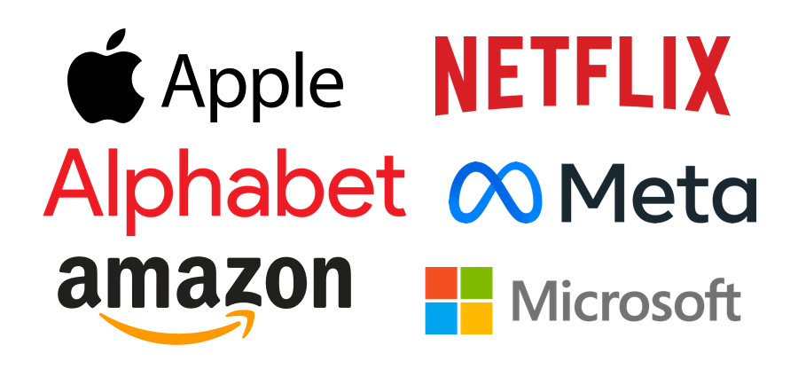
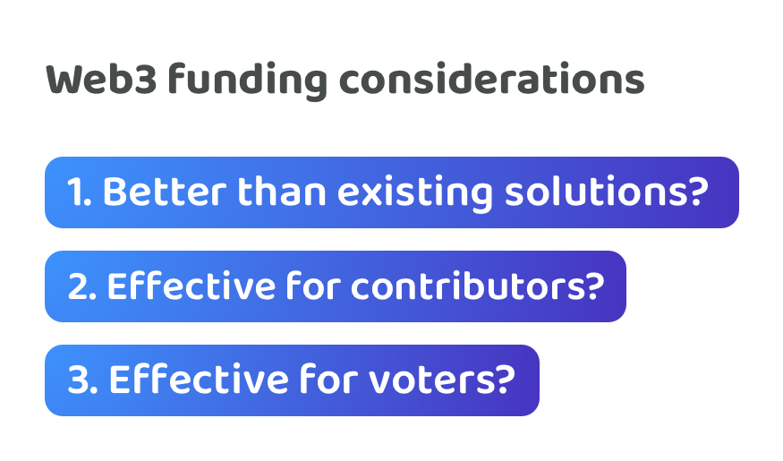

# Tech company comparison



This page contains the same information that is covered in the above video

***

<figure><figcaption></figcaption></figure>

Comparisons can be made between Web3 ecosystems and large tech companies. Large tech companies are a great case study for Web3 ecosystems due to a number of overlapping areas. Over the last few decades these tech companies have been some of the most desirable places to work on the planet. Partly due to ambitious global missions coupled with great incentives and employee benefits. Now these companies have obviously not got everything right, however some great learnings can be made by looking at what has worked well for the both employees and these companies. The comparison that we’re most interested in thinking about here is around the idea funding process that is commonly used in Web3 ecosystems and comparing this with the working environment and incentive structures that used with employees in tech companies.

**Web3 & tech company overlapping areas**

Large tech companies can provide a number of useful learnings about growing a large ecosystem that has many full time contributors. Larger companies can share a number of overlapping areas with Web3 ecosystems:

* **Number of contributors involved** - Tech companies such as Apple, Microsoft, Amazon, Alphabet and Meta have scaled to handle a vast number of contributors that work on different products and services. Both tech companies and Web3 ecosystems have a large number of skilled contributors that help with executing different ideas.
* **Skill sets** - Both large tech companies and Web3 ecosystems rely heavily on competent software developers to build high quality and scalable solutions that can scale to the masses. Product, design, research and analysis are many other skill sets that both these ecosystems can highly benefit from.
* **Problem scale** - Web3 ecosystems and tech companies both are trying to solve global problems which means solving global scale technical challenges and creating well refined products & services that could be used by the large populations.
* **Execution complexity** - Both tech companies and Web3 ecosystems are involved in complex execution efforts. Whether that’s AI, blockchain or virtual reality there is often execution efforts that span multiple years to actually create impactful products and services.
* **Shared execution problems** - Large tech companies and Web3 ecosystems both reach a scale where there are many shared problems within their ecosystem that benefit from shared solutions. React and GraphQL are a great example of this within Meta, where first they became an increasingly adopted solution within Meta, but not soon after then became open source and then generated wider impact across the entire software industry.

**Tech company working environment**

Other useful learnings that can be taken from existing tech companies are the environments they have created that can help their contributors focus and thrive whilst they work on important problems. Some of these environmental approaches include:

* **Time based incentives** - Tech companies use time based incentives. Contributors are paid for their time based on an agreed salary. Once this amount is agreed contributors do not need to be concerned with where and how they are getting paid and instead can focus their entire attention on their own work efforts.
* **Bonus incentives** - Large companies often offer performance and impact based incentives in the form of stock options, bonuses and job promotions. Employee benefits might also exist that further help with simplifying and improving the lives of employees so they can be more productive.
* **Contribution flexibility** - Contribution flexibility is an important factor if you want a more dynamic workforce. Companies often enable employee to move across teams and make impactful contributions where they are most needed. Employees do not need to be concerned with how they are going to be paid when they work across multiple teams and potentially help with multiple initiatives. Now it’s worth stating the obvious that not every company is as flexible as others. Though a great example of a company on the really high end of contribution flexibility would be [Valve Software](https://www.valvesoftware.com/en/). Employees in Valve are free to move and help with any project that interests them and where they believe they can add value.
* **Collaborative environment** - Teams working on different projects and services can freely collaborate with any other team in the company if it made sense to do so. These employees all work in the same company so ultimately they are all on the same team! The incentives are fully aligned for employees to collaborate on any problems or opportunities that could be mutually beneficial for those teams and the wider company.
* **Quickly changing ideas** - Ideas can also quickly change in these environments. Teams often have a moderate amount of autonomy when working on different products & services and often take the leading role in planning their own roadmap and delivery of new features and improvements. This enables them to experiment and trial new ideas quickly as different opportunities emerge without needing to seek approval from everyone else in the company.
* **Pausing idea execution** - Teams are often able to start and stop working on different ideas whenever it makes sense to do so. Some ideas won’t generate the intended outcomes that were desired and in that event a team could stop working on it as soon as this becomes obvious. If a team moves from one idea to another this won’t change or impact their incentives. Each employee and team are ultimately responsible for making as much impact for the company as possible.

**Common reasons people leave tech companies**

The following are some example common reasons why people leave large companies. This can help with identifying which Web3 funding approaches might help with resolving or reducing these issues in the future.

* **Better work-life balance** - Looking for opportunities that have better work-life balance.
* **Looking for more meaningful work** - Current responsibilities or working environment is uninspiring.
* **Personal values misalignment** - Actions and outcomes generated by the company don’t align with personal values.
* **Lack of career advancement** - A lack of opportunities to grow and learn.
* **Burnout** - A need for recovery due to over working.
* **Management & leadership issues** - Conflict or disagreement with people that have authority.
* **Entrepreneurial aspirations** - Trying to start a new business themselves.
* **Relocation -** Wanting to live and work in another location.
* **Changing work interests** - Looking to try something new or more challenging.

**Tech companies compared with current Web3 funding landscape**

* **Less complexity to contribute** - There’s less complexity to contribute in a large tech company. An potential employee just needs to submit their personal and professional information, often in the form of a CV to be considered by the company. Promising candidates will then go through a one time interview process and if selected can join the company and receive ongoing compensation. In comparison, Web3 ecosystems contributors need to define and suggest ideas ahead of time which takes a large amount of upfront work to be considered for compensation. There’s also increased complexity for Web3 contributors as they need to do this every time they want to be funded a different idea.
* **Higher income stability** - Once hired a tech company employee doesn’t need to be concerned about how much income they are receiving each month, it’s pre-determined and agreed. For Web3 contributors they often need to budget ideas ahead of time and this can easily lead to becoming under or over paid due to differences in how long the idea actually takes to execute. They also have reduced stability due to the fact that their ideas they suggest might not be selected to receive funding meaning they may go through periods of receiving no income at all.
* **Higher contribution flexibility** - Higher contribution flexibility can mean contributors are more easily able to allocate their time to the most impactful initiatives. Employees can often work on numerous ideas and different teams whilst they work in an organisation. The idea that a team is working on could completely change if they had good reason to make that change, they could end up addressing a completely different problem or opportunity. New teams can quickly form to address any emerging problems or opportunities. In Web3 ecosystems if every idea is funded separately there is a higher complexity to move to different ideas unless there is enough funding available and a working agreement is made about who is going to be paid for what execution efforts. Alternatively if these agreements can’t be made then every single idea would need to be approved and funded separately which delays the speed in which these ideas can be explored and developed. When a token has been created this complexity is only increased further as now the contributors involved in this project are now responsible for maintaining and growing that particular idea and ecosystem that this token is used for. This can easily prevent contributors from being able to move as easily between ideas and help with different initiatives that could have generated a lot of impact for the ecosystem.
* **Easier collaboration** - In companies employees are paid for their contribution efforts each month rather than for the ideas that they suggest and execute. This means it doesn’t matter which idea an employee is working on as long as the outcomes from their efforts help to generate impact for the company. Collectively these employees are all working on the same team which enables teams to more easily identify intersecting problems and opportunities that they could work on collaboratively. Software libraries created in Meta such as React and GraphQL are great examples of this. In Web3 ecosystems collaboration is more complex as funding is allocated through ideas meaning if one team executes these intersecting ideas and doesn’t complete their own funded idea they risk receiving a lower amount of compensation for their efforts due to this idea not being funded and could also risk not being funded in the future due to not focussing on their own idea. Contributors in an idea funding environment have to compete against each other constantly to receive funding which doesn’t fully align the incentives to collaborate and give their time to build out mutually beneficial solutions without the burden of first coming to new working agreements.
* **Less complexity for decision makers** - Companies focus on identifying, attracting and retaining the highest quality people they can to work in their organisation. The complexity for companies is comparing and selecting the best contributors. In Web3 ecosystems this complexity is often far higher as comparing ideas instead of contributors means a lot more information and complexity is introduced. Many of the voters will struggle to have the right level of experience and context about these ideas to make well informed decisions. Web3 ecosystems that want to fully decentralise this idea selection approach will be pushing this massive complexity to the wider community. This idea decision complexity is also a persistent problem for Web3 ecosystems as ideas will constantly change - you don’t keep executing the same idea! In comparison competent contributors do not change as often, and this is why tech companies will look to simply retain their talented employees that work on one or many ideas at a time.

**Web3 funding considerations**

Web3 technology has the potential to completely rewrite how society operates on a day to day basis and influence how incentives flow through these ecosystems to consistently generate impactful outcomes.

<figure><figcaption></figcaption></figure>

When thinking about how to design a funding process for Web3 ecosystems some considerations that can be made are:

* Is a given funding approach more effective than the previous systems and processes we’ve seen before?
* Is it becoming easier or harder for contributors to get involved and receive fair compensation for their efforts?
* Can the funding process feasibly scale to a wider voting audience? Is the complexity increasing or decreasing for voter over time?

There was a time where these existing tech companies were the most novel and new places to watch or work in. It was really exciting to see them rapidly evolve and change to create new markets and address global problems. Blockchain and ledger technology is going through this same phase now but eventually it will become just another piece of technology like existing internet protocols such as HTTP, SMTP and TCP/IP.&#x20;

Web3 ecosystems are trying to recreate and improve the money and systems that society uses on a day to day basis. An effective funding process can help with aligning and fixing the incentives, which will be a key part of making these emerging Web3 ecosystems thrive over the long term.
